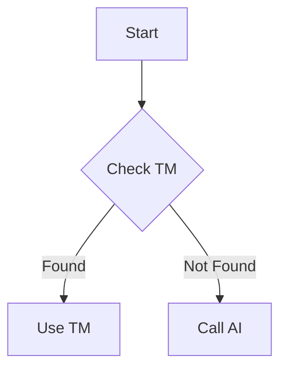
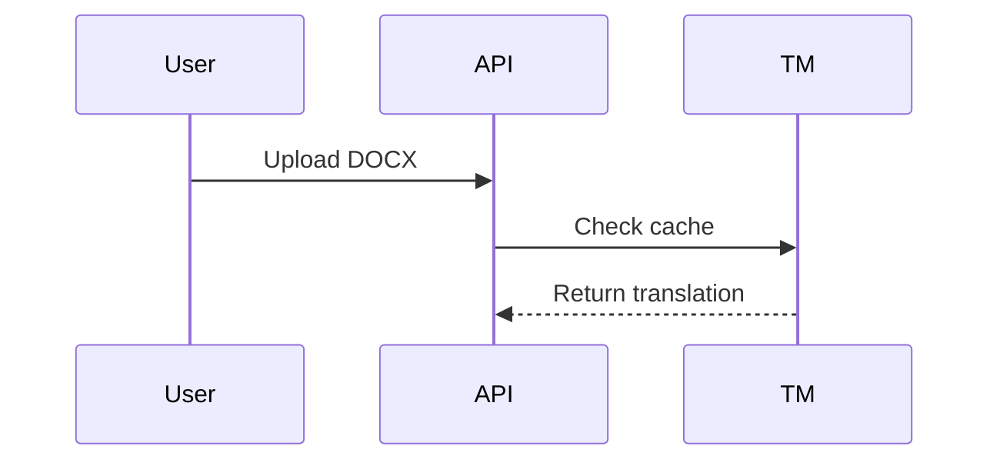
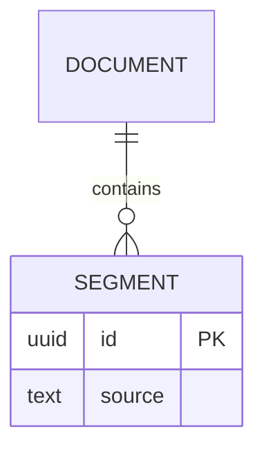

# 📖 Documentation Protocol

**Version:** 3.0.0  
**Last Updated:** 2026-01-26

---

## 🎯 Overview

**Purpose:** Standards for working with Docusaurus documentation system

**When:** PŘED any doc creation/modification in `docs/`

**Key:** MDX syntax requires special escaping, proper sidebar IDs, and complete YAML frontmatter

---

## 📂 Directory Structure

```
{project-root}/docs/
├── docs/                    # All documentation content
│   ├── stakeholders/        # Non-technical guides
│   ├── workflows/           # Process documentation
│   ├── developers/          # Technical guides
│   ├── architecture/        # System design
│   └── api-reference/       # API documentation
├── blog/                   # Release notes
├── static/                 # Static assets
├── sidebars.ts             # Sidebar configuration
├── docusaurus.config.ts    # Main configuration
└── package.json            # Dependencies
```

---

## 🚨 CRITICAL: MDX Escaping

MDX parser interprets specific characters as JSX syntax. **ALWAYS escape:**

### 1. Curly Braces (Variables/Placeholders)

```markdown
❌ BAD: GET /jobs/{job_id}
✅ GOOD: GET `/jobs/{job_id}`

❌ BAD: Use {variable} in code
✅ GOOD: Use `{variable}` in code

❌ BAD: {"key": "value"}
✅ GOOD: ```json
{"key": "value"}
```
```

### 2. Less Than Symbol (<)

```markdown
❌ BAD: Latency: <100ms
✅ GOOD: Latency: under 100ms
✅ GOOD: Latency: &lt;100ms

❌ BAD: <0.75: Low similarity
✅ GOOD: Below 0.75: Low similarity

❌ BAD: <$0.03/1K words
✅ GOOD: under $0.03 per 1K words
```

### 3. Numeric Ranges

```markdown
❌ BAD: AI translation: 1-3 seconds
✅ GOOD: AI translation: `1-3 seconds`
✅ GOOD: AI translation: 1 to 3 seconds
```

---

## 🔗 Sidebar IDs & File Paths

**CRITICAL:** Docusaurus uses **relative paths WITHOUT `docs/` prefix and WITHOUT numeric prefixes**

**Mapping:**
```
Physical Path:    docs/docs/02-developers/backend/api.md
Remove prefix:    docs/docs/
Remove numbers:   02-
Document ID:      developers/backend/api
Sidebar ref:      'developers/backend/api'
```

**Process:**
1. Create file: `docs/docs/02-developers/backend/api-design.md`
2. Remove `docs/docs/` and numeric prefix: `developers/backend/api-design`
3. Use in `sidebars.ts`:
```typescript
// ❌ WRONG
items: ['02-developers/backend/api-design']

// ✅ CORRECT
items: ['developers/backend/api-design']
```

---

## 📝 YAML Frontmatter (REQUIRED)

**Every doc file MUST have:**

```yaml
---
title: Document Title (H1)
sidebar_label: Short Label
last_updated: 2026-01-26
status: current  # current | deprecated | draft
audience:
  primary: [ai-developer]
  secondary: [pm, stakeholder]
complexity: intermediate  # beginner | intermediate | advanced
read_frequency: reference  # onboarding | regular | reference
tags:
  - api
  - backend
related_docs:
  - developers/backend/api-design.md
---
```

**Required fields:**
- `title` - H1 heading, page title
- `sidebar_label` - Sidebar display name
- `last_updated` - YYYY-MM-DD format
- `status` - current/deprecated/draft
- `audience.primary` - Main target readers
- `complexity` - beginner/intermediate/advanced
- `read_frequency` - onboarding/regular/reference

---

## 🛠️ Development & Testing

### Start Server (Network-Accessible)

**⚠️ MUST run on network IP (NOT localhost!):**

```bash
cd {project-root}/docs
npm start -- --host {network-ip} --port 3000
```

Access: `http://{network-ip}:3000`

### Test Before Commit

```bash
cd {project-root}/docs
npm run build
```

**Common errors:**
- `MDX compilation failed` → Check curly braces, `<` symbols
- `sidebar document ids do not exist` → Check numeric prefixes
- `Duplicate routes` → Check for duplicate slugs

---

## 🎨 Mermaid Diagrams

**Use Mermaid for ALL diagrams (NO images!):**

### Flowchart
````markdown

````

### Sequence Diagram
````markdown

````

### ER Diagram
````markdown

````

---

## ✅ Pre-Commit Checklist

**BEFORE committing doc changes:**

- [ ] MDX syntax validated (no unescaped `{var}`, `<100`)
- [ ] Sidebar IDs correct (no numeric prefixes)
- [ ] YAML frontmatter complete (all required fields)
- [ ] Internal links tested
- [ ] Mermaid diagrams render
- [ ] `npm run build` passes
- [ ] No console errors in browser

---

## 🚨 Common Errors & Fixes

**Error: "job_id is not defined"**
```markdown
❌ GET /api/jobs/{job_id}
✅ GET `/api/jobs/{job_id}`
```

**Error: "MDX compilation failed"**
```markdown
❌ Latency: <100ms
✅ Latency: under 100ms
```

**Error: "sidebar document ids do not exist"**
```typescript
❌ items: ['02-developers/backend/api']
✅ items: ['developers/backend/api']
```

---

## 📚 Best Practices

### 1. Write for Audience

**Stakeholder docs:**
- No technical jargon
- Focus on business value
- Include diagrams
- Simple language

**Developer docs:**
- Technical details
- Code examples
- API references
- Error handling

### 2. Docs with Code

**When you change code:**
1. Identify affected docs
2. Update docs IN SAME COMMIT
3. Test docs locally (`npm run build`)
4. Commit code + docs together

### 3. Maintain Metadata

**Update on every edit:**
```yaml
---
last_updated: 2026-01-26  # ← Change this!
---
```

---

## 🎯 Key Takeaways

1. **Always escape curly braces:** `` `{variable}` ``
2. **Always escape `<` before numbers:** `under 100ms` or `&lt;100ms`
3. **Never use numeric prefixes in sidebars.ts**
4. **Always complete YAML frontmatter**
5. **Always test with `npm run build` before commit**
6. **Always run on network IP (not localhost)**
7. **Always update docs IN SAME COMMIT as code**

---

**See also:**
- [coding-standards.md](coding-standards.md) - Code quality standards
- [quality-gates.md](quality-gates.md) - Pre-commit verification
- [task-complete.md](../quick-reference/task-complete.md) - Task completion workflow
