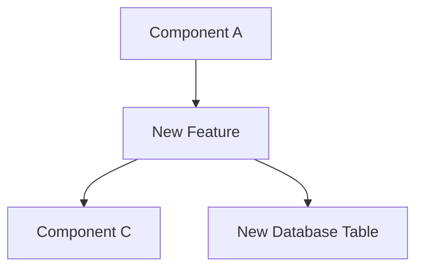
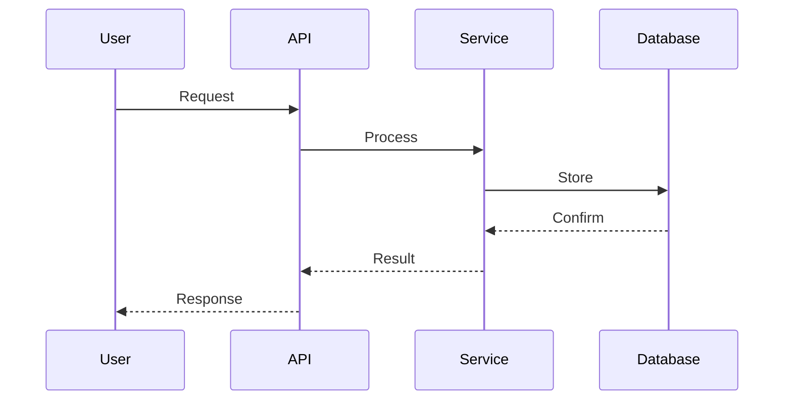

# ✨ New Feature: {Title}

## 📂 Struktura souboru

**Obsah tohoto session file:**
- Objective - cíl nové feature
- Requirements - business requirements, technical requirements, constraints
- Design - architecture decision, component diagram, data flow, API contract
- Implementation - changes made, code snippet
- Testing - test plan a test results
- Impact - metrics (LOC, test coverage, performance, cost)
- Documentation Updates - seznam aktualizovaných docs
- References - related issues, PRs, documentation, sessions, commits
- AI Session Log - timeline akcí a rozhodnutí
- Completion Checklist - pre-completion a session closure
- Next Steps - pro human review a AI

**Related Files:**
- Epic breakdown: `.ai-workflow/workplace/epics/{active|completed}/{epic-id}/epic-breakdown.md` (if epic)
- Session log: `.ai-workflow/workplace/session-log.md`
- Templates: `.ai-workflow/templates/session-new-feature.md`
- Workflow: `.ai-workflow/instructions/workflows/new-feature.md`

---

## 🤖 AI Model Settings (Recommended)

**Pro tuto new feature session doporučujeme:**
- **Temperature:** 0.3-0.5 (střední - vyvážení kreativity a přesnosti)
- **Top-P:** 0.9-0.95 (vyvážený výběr tokenů)
- **Frequency Penalty:** 0.2-0.4 (nízká - nové features mohou mít opakující se patterny)

**Proč:**
- Nové features potřebují vyvážení mezi kreativitou (design, architektura) a přesností (implementace)
- Střední temperature umožňuje kreativní návrhy, ale zachovává přesnost implementace
- Nízká frequency penalty umožňuje opakující se patterny (např. CRUD operace)

**Fázové nastavení:**
- **Design/Architecture fáze:** Temperature 0.5, Top-P 0.95
- **Implementation fáze:** Temperature 0.3, Top-P 0.9
- **Testing fáze:** Temperature 0.2, Top-P 0.9

**Reference:** `.ai-workflow/instructions/core/ai-model-settings.md`

---

> **💡 Multi-Session Work?** If this feature requires 3+ sessions or involves multiple components (backend + frontend + docs), consider creating an **Epic Breakdown** first using `.ai-workflow/templates/epic-breakdown.md` before starting individual session files.

## 🎯 Objective
> One-sentence description of the new feature

## 📋 Requirements

### Business Requirements
**User Story:**
> As a {user type}, I want {goal} so that {benefit}

**Example:**
> As a translator, I want to export translations with original formatting preserved, so that I don't have to manually fix styles.

**Success Criteria:**
- {Criterion 1}
- {Criterion 2}
- {Criterion 3}

### Technical Requirements
- **Must Have:**
  - [ ] {Requirement 1}
  - [ ] {Requirement 2}
  
- **Should Have:**
  - [ ] {Requirement 3}
  
- **Nice to Have:**
  - [ ] {Requirement 4}

### Constraints
- **Performance:** {e.g., "Response time < 2s"}
- **Security:** {e.g., "Data encryption at rest"}
- **Compatibility:** {e.g., "DOCX 2007+ format support"}
- **Budget:** {e.g., "Additional cost < $5/month"}

---

## 🏗️ Design

### Architecture Decision
{High-level approach and why chosen}

**Options Considered:**
1. **Option A:** {Description}
   - Pros: {list}
   - Cons: {list}
   
2. **Option B:** {Description}
   - Pros: {list}
   - Cons: {list}

**Chosen:** Option A  
**Rationale:** {Why this option is best}

**Location:** `docs/docs/architecture/design-decisions.md`

### Component Diagram


### Data Flow


### API Contract
**New Endpoints:**
```
POST /api/v1/{resource}
GET /api/v1/{resource}/{id}
PUT /api/v1/{resource}/{id}
DELETE /api/v1/{resource}/{id}
```

**Request Schema:**
```json
{
  "field1": "string",
  "field2": 123,
  "field3": ["array"]
}
```

**Response Schema:**
```json
{
  "id": "uuid",
  "field1": "string",
  "created_at": "2025-01-05T10:00:00Z"
}
```

---

## 🛠️ Implementation

### Changes Made
| File | Lines | Description | Commit |
|------|-------|-------------|--------|
| {path/file.py} | 123-145 | {What changed} | {hash} |

### Code Snippet
```python
# Show key implementation here
```

---

## 🧪 Testing

### Test Plan
- [ ] Unit tests added/updated
- [ ] Integration tests pass
- [ ] Manual QA in dev environment
- [ ] UAC testing (if user-facing)
- [ ] Edge cases covered
- [ ] Performance validated

### Test Results
**Unit Tests:**
```
pytest tests/test_new_feature.py
✅ test_feature_creation - PASSED
✅ test_feature_validation - PASSED
```

**UAC Testing:**
- ✅ User can create {feature}
- ✅ User can update {feature}
- ✅ User can delete {feature}

---

## 📈 Impact

### Metrics:
- **Lines of Code:** {X} added, {Y} modified
- **Test Coverage:** {X}%
- **Performance:** {metrics}
- **Cost Impact:** {if applicable}

---

## 📝 Documentation Updates

**Updated:**
- [ ] `docs/docs/api-reference/` - API docs regenerated
- [ ] `docs/docs/developers/` - Developer guides updated
- [ ] `docs/docs/stakeholders/` - User guides updated (if user-facing)
- [ ] `CHANGELOG.md` - Added entry

**See:** `.ai-workflow/instructions/core/coding-standards.md` for documentation dependency tables

---

## 🔗 References

**Related Issues:**
- #{issue_number} - {title}

**Related PRs:**
- #{pr_number} - {title}

**Documentation:**
- [Feature Guide](../../docs/docs/stakeholders/{feature-guide}.md)

**Related Sessions:**
- [Previous session](../completed/{session-id}.md)

**Commits:**
- `{hash}` - {message}
- `{hash}` - {message}

---

## 💬 AI Session Log

**{Timestamp}** - {Action/Decision}

**Example:**
- **10:00 CET** - Started design phase, created ADR
- **10:30 CET** - Implemented core functionality
- **11:00 CET** - Added tests, all passing
- **11:30 CET** - Documentation updated, session complete

---

## ✅ Completion Checklist

### Pre-Completion:
- [ ] Feature implemented and tested
- [ ] Tests written and passing
- [ ] Documentation updated
- [ ] No TODO/FIXME left in code
- [ ] Logging added for monitoring

### Session Closure:
- [ ] Commit messages follow conventions
- [ ] Session file archived to completed/
- [ ] **Handoff protocol executed** (MANDATORY)
  - See: `.ai-workflow/instructions/core/session-management.md` § Handoff Protocol
- [ ] All documentation commits created
- [ ] Automation scripts run (git-change-checker, session-validator)

---

## 🎬 Next Steps

**For Human Review:**
- Review PR #{pr_number}
- Validate feature in staging
- Approve for production deploy

**For AI (if session continues):**
- Monitor for related issues
- Consider optimization opportunities
- Update related features

---

**Status:** {active|blocked|completed}  
**Last Updated:** {YYYY-MM-DD HH:MM CET}  
**Completion:** {%}

