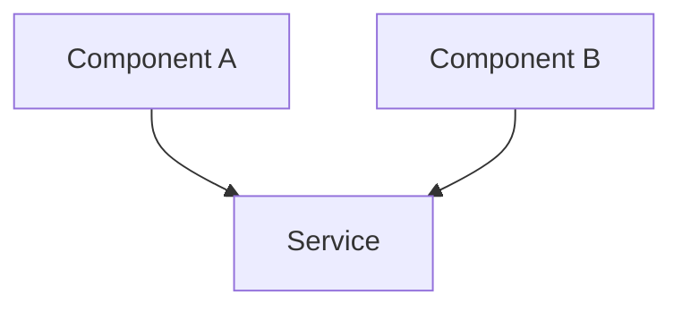
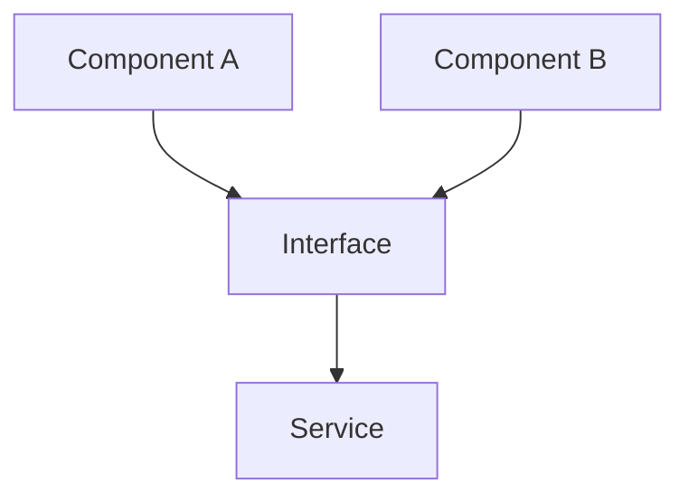

# 🔄 Refactoring: {Title}

## 📂 Struktura souboru

**Obsah tohoto session file:**
- Objective - cíl refactoringu
- Motivation - why refactor, expected benefits, risk assessment
- Refactoring Strategy - scope, approach, design patterns used
- Architecture Changes - before/after diagrams
- Implementation - changes made, code snippet
- Testing - test plan, before/after results
- Impact - metrics (LOC, test coverage, performance, maintainability)
- Documentation Updates - seznam aktualizovaných docs
- References - related issues, PRs, documentation, sessions, commits
- AI Session Log - timeline akcí a rozhodnutí
- Completion Checklist - pre-completion a session closure
- Next Steps - pro human review a AI

**Related Files:**
- Epic breakdown: `.ai-workflow/workplace/epics/{active|completed}/{epic-id}/epic-breakdown.md` (if epic)
- Session log: `.ai-workflow/workplace/session-log.md`
- Templates: `.ai-workflow/templates/session-refactoring.md`
- Workflow: `.ai-workflow/instructions/workflows/refactoring.md`

---

## 🤖 AI Model Settings (Recommended)

**Pro tuto refactoring session doporučujeme:**
- **Temperature:** 0.1-0.2 (nízká pro bezpečnost a konzistenci)
- **Top-P:** 0.9 (omezuje na nejpravděpodobnější tokeny)
- **Frequency Penalty:** 0.4-0.6 (vyšší - refactoring často zahrnuje opakující se patterny)

**Proč:**
- Refactoring musí být deterministický a bezpečný - chceme konzistentní, předvídatelné změny
- Nízká temperature zajišťuje, že stejný pattern bude refaktorován stejně
- Vyšší frequency penalty zajišťuje, že AI nenapíše stejný kód vícekrát různými způsoby

**Alternativa pro rozsáhlý refactoring:**
- Temperature: 0.3 (pokud refactoring vyžaduje více kreativity při návrhu nové struktury)

**Reference:** `.ai-workflow/instructions/core/ai-model-settings.md`

---

> **💡 Multi-Session Work?** If this refactoring requires 3+ sessions or touches multiple architectural layers (DB + services + API + frontend), consider creating an **Epic Breakdown** first using `.ai-workflow/templates/epic-breakdown.md` before starting individual session files.

## 🎯 Objective
> One-sentence description of what needs to be refactored and why

## 📊 Motivation

### Why Refactor?
**Current Pain Points:**
- {Pain point 1}
- {Pain point 2}
- {Pain point 3}

**Example:**
- Code duplication across 3 parsers (DOCX, PDF, TXT)
- No clear separation of concerns
- Hard to add new file format support
- Test coverage only 45%

### Expected Benefits
**After Refactoring:**
- {Benefit 1}
- {Benefit 2}
- {Benefit 3}

**Example:**
- Single abstract parser interface
- 80%+ test coverage
- New format support in <1 day
- Improved maintainability

### Risk Assessment
**Risks:**
- 🔴 **HIGH:** Breaking existing functionality
- 🟡 **MEDIUM:** Regression in performance
- 🟢 **LOW:** Increased complexity

**Mitigation:**
- Comprehensive test suite before refactoring
- Performance benchmarks (before/after)
- Gradual rollout with feature flag

---

## 🏗️ Refactoring Strategy

### Scope
**In Scope:**
- [ ] {Component 1}
- [ ] {Component 2}
- [ ] {Related tests}

**Out of Scope:**
- [ ] {Component 3} - Will refactor in future session
- [ ] {Component 4} - Too risky to touch now

### Approach
**Strategy:** {e.g., "Extract Interface", "Introduce Factory Pattern", "Split Monolith"}

**Steps:**
1. {Step 1}
2. {Step 2}
3. {Step 3}

### Design Patterns Used
- **Pattern 1:** {Name} - {Purpose}
- **Pattern 2:** {Name} - {Purpose}

---

## 📐 Architecture Changes

### Before (Current State)


### After (Target State)


---

## 🛠️ Implementation

### Changes Made
| File | Lines | Description | Commit |
|------|-------|-------------|--------|
| {path/file.py} | 123-145 | {What changed} | {hash} |

### Code Snippet
```python
# Show key refactoring here
```

---

## 🧪 Testing

### Test Plan
- [ ] All existing tests pass
- [ ] New tests for refactored code
- [ ] Performance benchmarks (before/after)
- [ ] No regressions

### Test Results
**Before Refactoring:**
- Test coverage: {X}%
- Performance: {metrics}

**After Refactoring:**
- Test coverage: {Y}%
- Performance: {metrics}

---

## 📈 Impact

### Metrics:
- **Lines of Code:** {X} removed, {Y} added
- **Test Coverage:** {before}% → {after}%
- **Performance:** {before} → {after}
- **Maintainability:** {improvement}

---

## 📝 Documentation Updates

**Updated:**
- [ ] `docs/docs/architecture/` - Architecture diagrams updated
- [ ] `docs/docs/developers/` - Developer guides updated
- [ ] `CHANGELOG.md` - Added entry (if user-facing)

**See:** `.ai-workflow/instructions/core/coding-standards.md` for documentation dependency tables

---

## 🔗 References

**Related Issues:**
- #{issue_number} - {title}

**Related PRs:**
- #{pr_number} - {title}

**Documentation:**
- [Architecture Guide](../../docs/docs/architecture/system-overview.md)

**Related Sessions:**
- [Previous session](../completed/{session-id}.md)

**Commits:**
- `{hash}` - {message}
- `{hash}` - {message}

---

## 💬 AI Session Log

**{Timestamp}** - {Action/Decision}

**Example:**
- **10:00 CET** - Started refactoring, created interface
- **10:30 CET** - Refactored component A
- **11:00 CET** - Refactored component B
- **11:30 CET** - All tests passing, documentation updated

---

## ✅ Completion Checklist

### Pre-Completion:
- [ ] Refactoring complete and tested
- [ ] All tests passing
- [ ] No regressions
- [ ] Documentation updated
- [ ] Performance maintained or improved

### Session Closure:
- [ ] Commit messages follow conventions
- [ ] Session file archived to completed/
- [ ] **Handoff protocol executed** (MANDATORY)
  - See: `.ai-workflow/instructions/core/session-management.md` § Handoff Protocol
- [ ] All documentation commits created
- [ ] Automation scripts run (git-change-checker, session-validator)

---

## 🎬 Next Steps

**For Human Review:**
- Review PR #{pr_number}
- Validate refactoring in staging
- Approve for production deploy

**For AI (if session continues):**
- Monitor for related issues
- Consider further optimizations
- Update related features

---

**Status:** {active|blocked|completed}  
**Last Updated:** {YYYY-MM-DD HH:MM CET}  
**Completion:** {%}

